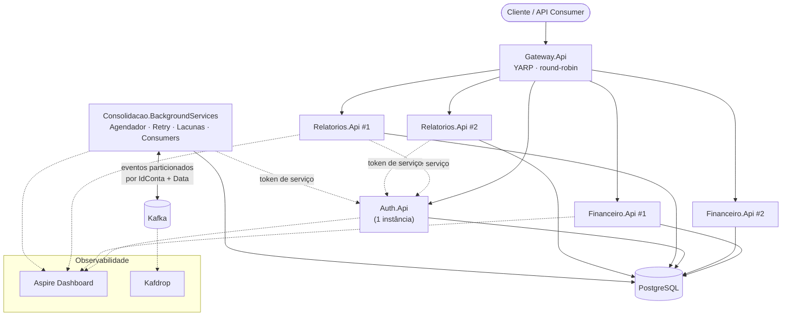

<p align="center">
  
</p>

<h1 align="center">LeoVinciFinance</h1>

<p align="center">
  <i>"La semplicità è l'ultima sofisticazione."</i> — Leonardo da Vinci
</p>

---

## Sobre o projeto

Assim como Leonardo da Vinci tratava a anatomia, a engenharia e a arte como uma única
disciplina, o **LeoVinciFinance** nasce da convicção de que um sistema bem arquitetado é,
antes de tudo, uma obra de composição: cada módulo é um estudo de proporção, cada fronteira
de domínio é um traço deliberado, e nada existe no desenho final por acaso.

Este repositório é a peça que reúne, em código executável, o estado atual do meu
conhecimento arquitetural: **Clean Architecture**, **modularização por domínio**,
**mensageria orientada a eventos**, **observabilidade nativa** e **rastreabilidade de
decisões técnicas** (ADRs e diagramas C4), aplicados a um sistema de controle financeiro, construído em **.NET 10**.

Não é um esboço nem um exercício acadêmico, é um produto lapidado com o mesmo cuidado que
se dedicaria a uma gema: cada faceta (Auth, Financeiro, Relatórios, Consolidação) foi
cortada para refletir uma responsabilidade clara, e o conjunto forma uma peça única,
coerente e assinada.

**LVF** — Leonardo Simões · LeoVinciFinance.

---

## Resumo do produto

O LeoVinciFinance é um **sistema de controle financeiro modular** composto por quatro
domínios independentes, que se comunicam por meio de um Gateway HTTP único e, no caso da
Consolidação, também por eventos assíncronos via Kafka:

| Módulo | Responsabilidade |
| --- | --- |
| **Auth** | Autenticação, emissão de JWT e perfis de acesso (Admin / Comerciante). 1 instância. |
| **Financeiro** | Cadastro de clientes/contas e lançamentos financeiros. API puramente request/response — **não depende de mensageria** (ver ADR 0011). 2 instâncias atrás do Gateway. |
| **Relatórios** | Consulta de saldos e saldo diário consolidado. 2 instâncias atrás do Gateway. |
| **Consolidação** | Workers em background que calculam o saldo diário consolidado de cada conta, publicam/consomem eventos internos via Kafka (MassTransit) e tratam retries e lacunas de processamento. |


## Versão atual V.0.1.0-alpha (Funcionalidades Iniciais - MVP)

- Controle de fluxo de caixa diário com os lançamentos (débitos e créditos). também precisa de um relatório que disponibilize o saldo diário consolidado.
- Relatório de saldo diário consolidado por conta, com histórico de lançamentos.

### Visão geral da aplicação



Todo o tráfego externo entra por um único ponto (`Gateway.Api`), que também é usado
internamente por Relatórios e Consolidação para chamar Financeiro/Relatórios — assim o
balanceamento entre as duas instâncias de cada API vale tanto para o cliente externo quanto
para a comunicação entre módulos.

---

## Documentação

A rastreabilidade das decisões é parte do produto, não um anexo. Estes são os principais
pontos de entrada:

| Local | O que você encontra lá |
| --- | --- |
| [`docker/`](docker) | Dockerfile de cada serviço (Auth, Financeiro, Relatórios, Consolidação, Gateway) e o `init-schemas.sql` usado para provisionar os schemas do PostgreSQL na subida via Docker Compose. |
| [`docker-compose.yml`](docker-compose.yml) | Orquestração completa do ambiente local: as APIs (com múltiplas instâncias onde previsto), Kafka, Postgres, Redis, Aspire Dashboard e Kafdrop. |
| [`docs/adr/`](docs/adr) | **Architecture Decision Records** — o histórico formal de decisões arquiteturais e seus trade-offs (ex.: a ADR 0011, que proíbe o módulo Financeiro de depender de mensageria ou de outro módulo para estar disponível). Cada ADR documenta o contexto, a decisão tomada e as alternativas descartadas. |
| [`docs/c4/`](docs/c4) | Diagramas **C4 Model** (Contexto, Contêineres, Componentes) descrevendo a arquitetura em diferentes níveis de zoom — do sistema como um todo até os componentes internos de cada módulo (ver `docs/c4/component.md` para o desenho da Consolidação). |
| [`docs/architecture/`](docs/architecture) | Visão consolidada da arquitetura vigente (`architecture.md`), usada como referência única de verdade para o desenho atual do sistema. |

---

## Stack Tecnológico

- **Runtime / Linguagem**: .NET 10, C#
- **Estilo arquitetural**: Clean Architecture + Modular Monolith orientado a domínios (Auth, Financeiro, Relatórios, Consolidação)
- **APIs**: ASP.NET Core Web API
- **Gateway**: YARP (reverse proxy, round-robin entre instâncias)
- **Persistência**: PostgreSQL + Entity Framework Core 10 (um schema por módulo)
- **Mensageria**: Apache Kafka via MassTransit (uso restrito ao módulo Consolidação)
- **Cache / suporte**: Redis
- **Segurança**: JWT Bearer, conta de serviço com token de longa duração
- **Resiliência**: Polly (retry, circuit breaker, timeout)
- **Integração HTTP entre módulos**: Refit
- **Observabilidade**: Serilog + OpenTelemetry, .NET Aspire Dashboard, Kafdrop
- **Testes**: xUnit, ArchUnitNET (testes de arquitetura/dependência entre camadas), Testcontainers (integração com Postgres real), NBomber (carga)
- **Infraestrutura local**: Docker + Docker Compose

---

## Pré-requisitos

- .NET SDK 10.0
- Docker + Docker Compose
- (Opcional, só para os testes de integração) Docker disponível para Testcontainers

## Estrutura da solution

```
src/
  BuildingBlocks/
    BuildingBlocks.Common        # Entity/DomainException, CQRS (ICommand/IQuery/Result), IUnitOfWork
    BuildingBlocks.WebHost       # JWT bearer, Swagger, Serilog + OpenTelemetry (uso exclusivo das *.Api)
    BuildingBlocks.ServiceAuth   # Token de conta de serviço + políticas Polly (uso das *.Infrastructure que chamam outros módulos)
  Auth/                          # Domain, Application, Infrastructure, Api
  Financeiro/                    # Domain, Application, Infrastructure, Api — NÃO usa Kafka (ver ADR 0011)
  Relatorios/                    # Domain, Application, Infrastructure, Api
  Consolidacao/                  # Domain (eventos: SaldoDiarioConsolidadoIniciado/Concluido/ComFalhas), Application, Infrastructure, BackgroundServices (Worker)
  Gateway/                       # Gateway.Api (YARP) — 2 nós para Financeiro e Relatórios
tests/
  UnitTests/                     # *.Domain.Tests por módulo
  ArchitectureTests/             # ArchUnitNET — valida as regras de dependência entre camadas/módulos
  IntegrationTests/              # Financeiro.Api.IntegrationTests (Testcontainers + Postgres real)
  LoadTests/                     # RelatoriosLoadTest (NBomber)
docker/                          # Dockerfiles de cada serviço + init-schemas.sql
docker-compose.yml
LeoVinciFinance.sln
```

## Como instalar?

### Primeira execução (local, sem Docker)

1. Suba um PostgreSQL local (ou `docker compose up postgres -d`). No diretório do projeto.
2. Gere e aplique as migrations de cada módulo:

```powershell
dotnet tool install --global dotnet-ef   # se ainda não tiver

foreach ($m in "Auth","Financeiro","Relatorios","Consolidacao") { $infra="src/$m/$m.Infrastructure"; dotnet ef migrations add InicialCreate --project "$infra/$m.Infrastructure.csproj" --startup-project "$infra/$m.Infrastructure.csproj"; if ($LASTEXITCODE -ne 0) { break }; dotnet ef database update --project "$infra/$m.Infrastructure.csproj" --startup-project "$infra/$m.Infrastructure.csproj"; if ($LASTEXITCODE -ne 0) { break } }
```

> **Nota:** durante a execução das migrations, pode ser exibida uma mensagem de erro
> semelhante à abaixo:
>
> ```
> Failed executing DbCommand (28ms) [Parameters=[], CommandType='Text', CommandTimeout='30']
> SELECT "MigrationId", "ProductVersion"
> FROM relatorios.__ef_migrations_history
> ORDER BY "MigrationId";
> ```
>
> Esse comportamento está relacionado a um bug conhecido do Entity Framework ao processar
> migrations em múltiplos schemas. A mensagem ocorre na etapa de verificação do histórico de
> migrations e não impede a criação ou execução normal da migration — pode ser desconsiderada
> desde que a migration seja posteriormente criada e aplicada com sucesso.

3. `appsettings.Development.json` de cada `*.Api`/Worker já vem com uma chave JWT e
   credenciais de desenvolvimento — **nunca usar esses valores em produção**.
4. Rode cada serviço em terminais separados:

```
dotnet run --project src/Auth/Auth.Api                    # porta 5001
dotnet run --project src/Financeiro/Financeiro.Api         # porta 5002
dotnet run --project src/Financeiro/Financeiro.Api --urls http://localhost:5012  # 2o no (opcional)
dotnet run --project src/Relatorios/Relatorios.Api         # porta 5003
dotnet run --project src/Relatorios/Relatorios.Api --urls http://localhost:5013  # 2o no (opcional)
dotnet run --project src/Consolidacao/Consolidacao.BackgroundServices
dotnet run --project src/Gateway/Gateway.Api                # porta 5000 (entrada unica)
```

### Execução via Docker Compose

```
cp .env.example .env   # preencha JWT_KEY e SERVICE_ACCOUNT_SENHA (SERVICE_ACCOUNT_TOKEN pode ficar vazio)
docker compose up --build
```

Serviços expostos:

| Serviço               | Porta(s)    | Descrição                                                                 |
| --------------------- | ----------- | ------------------------------------------------------------------------- |
| gateway-api           | 5000        | **Ponto único de entrada** (YARP, round-robin para Financeiro/Relatórios) |
| auth-api              | 5001        | 1 instância                                                               |
| financeiro-api-1 / -2 | 5002 / 5012 | 2 instâncias atrás do Gateway                                             |
| relatorios-api-1 / -2 | 5003 / 5013 | 2 instâncias atrás do Gateway                                             |
| aspire-dashboard      | 18888       | UI de observabilidade (traces OTLP)                                       |
| kafdrop               | 9000        | Inspeção visual dos tópicos/mensagens Kafka                               |
| postgres              | 5432        | —                                                                         |
| kafka                 | 9092        | —                                                                         |
| redis                 | 6379        | —                                                                         |

As migrations **não** rodam automaticamente no `docker compose up` — aplique-as manualmente
antes do primeiro uso (aponte a connection string para `localhost:5432`), usando o mesmo
comando descrito em "Primeira execução".

## Conta de serviço (Relatorios.Api e Consolidacao.BackgroundServices)

Essas duas partes do sistema chamam outros módulos internamente como o usuário
`service-consolidacao` (perfil Admin). Em vez de fazer login a cada chamada, configure um
token de longa duração:

```
# 1. Suba ao menos Auth.Api e Postgres, com as migrations aplicadas
curl -X POST http://localhost:5001/api/auth/login -H "Content-Type: application/json" -d '{"username":"service-consolidacao","senha":"ServiceConsolidacao@123"}'

# 2. Copie o "token" da resposta para SERVICE_ACCOUNT_TOKEN no .env (ou appsettings.Development.json)
# 3. Reinicie relatorios-api-*/consolidacao-worker
```

Se você não configurar `SERVICE_ACCOUNT_TOKEN`, o sistema funciona do mesmo jeito: cada
chamada valida o token vazio (falha), cai no fallback de login com `ServiceAccount:Senha`, e
loga um aviso sugerindo configurar o token. Funcionalmente idêntico, só um pouco mais lento.

## Usuários de desenvolvimento (seed)

| Username               | Senha                     | Perfil      | Uso                                                                 |
| ---------------------- | ------------------------- | ----------- | ------------------------------------------------------------------- |
| `admin`                | `Admin@123`               | Admin       | Acesso administrativo completo                                      |
| `comerciante`          | `Comerciante@123`         | Comerciante | Fluxo normal de lançamentos                                         |
| `service-consolidacao` | `ServiceConsolidacao@123` | Admin       | Conta de serviço (Relatorios.Api e Consolidacao.BackgroundServices) |

## Clientes e contas de desenvolvimento (HasData)

O `FinanceiroDbContext` utiliza `HasData` para gerar, por meio da migration do Entity
Framework, 3 clientes com 2 contas cada. Cada cliente possui um `IdUsuario` definido:

| Cliente        | IdUsuario | Contas   |
| -------------- | --------- | -------- |
| Cliente Seed 1 | `1`       | 2 contas |
| Cliente Seed 2 | `2`       | 2 contas |
| Cliente Seed 3 | `3`       | 2 contas |

Os IDs dos clientes e das contas são determinísticos. Portanto, as contas podem ser
consultadas após a aplicação da migration e utilizadas nos testes manuais. Esses dados não
são criados por um seed executado em runtime.

## Fluxo básico de teste manual

```
# 1. Login
curl -X POST http://localhost:5000/api/auth/login \
  -H "Content-Type: application/json" \
  -d '{"username":"comerciante","senha":"Comerciante@123"}'

# 2. Criar um lançamento (substitua TOKEN e IDCONTA)
curl -X POST http://localhost:5000/api/financeiro/lancamentos \
  -H "Content-Type: application/json" \
  -H "Authorization: Bearer TOKEN" \
  -d '{"idConta":"IDCONTA","valor":150.75}'

# 3. A consolidacao de HOJE so roda no proximo ciclo do agendador diario (ou do worker de
#    lacunas). Em desenvolvimento, appsettings.Development.json do worker usa intervalos bem
#    mais curtos (5-10 min) para nao precisar esperar 24h. Depois, consultar o saldo:
curl "http://localhost:5000/api/relatorios/saldo-diario-consolidado?idConta=IDCONTA&data=2026-09-14" \
  -H "Authorization: Bearer TOKEN"
```

> Não há endpoint para criar `Cliente`/`Conta` na Especificação Mestre original. Para os
> testes manuais, utilize as contas geradas pelo `HasData` após aplicar as migrations.

## Testes

```
dotnet test tests/UnitTests/Auth.Domain.Tests
dotnet test tests/UnitTests/Financeiro.Domain.Tests
dotnet test tests/UnitTests/Relatorios.Domain.Tests
dotnet test tests/UnitTests/Consolidacao.Domain.Tests     # agora cobre Job/Etapa/Execucao
dotnet test tests/ArchitectureTests                       # inclui a regra da ADR 0011 (Financeiro x MassTransit)
dotnet test tests/IntegrationTests/Financeiro.Api.IntegrationTests   # exige Docker (Testcontainers) - nao depende mais de Kafka
```

Teste de carga (requer o ambiente completo rodando e um token válido):

```
export LOAD_TEST_TOKEN="<token>"
export LOAD_TEST_ID_CONTA="<guid>"
dotnet run -c Release --project tests/LoadTests/RelatoriosLoadTest
```

---

<p align="center">
  <sub>LeoVinciFinance — arquitetado e assinado <b>LVF</b>.</sub>
</p>
