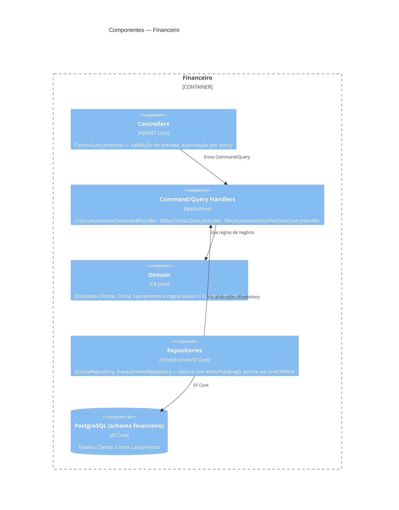
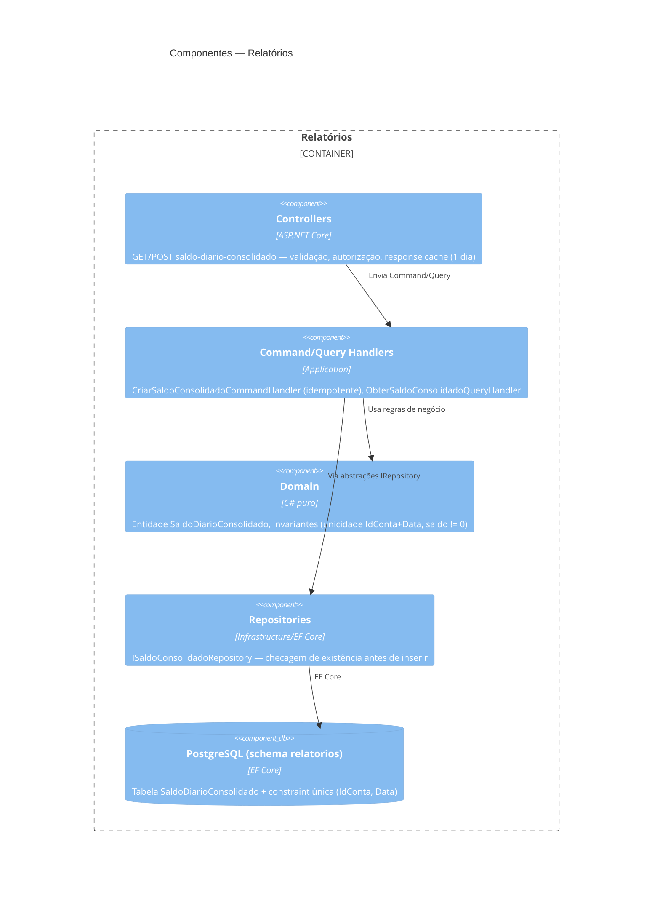
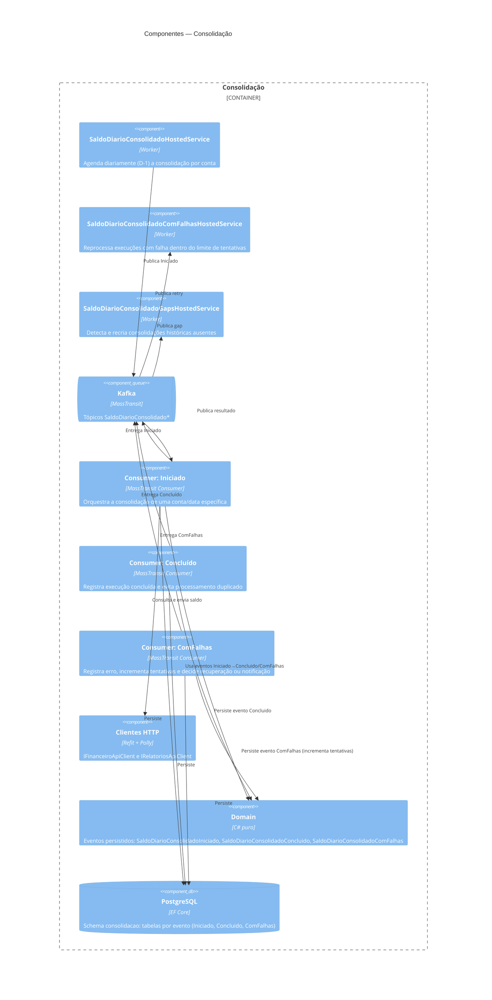

# C4 — Nível 3: Componentes

## Financeiro.Api

```mermaid

C4Component
    title Componentes — Financeiro

    Container_Boundary(financeiro, "Financeiro") {
        Component(controllers, "Controllers", "ASP.NET Core", "Contas/Lançamentos — validação de entrada, autorização por policy")
        Component(handlers, "Command/Query Handlers", "Application", "CriarLancamentoCommandHandler, ObterContasQueryHandler, ObterLancamentosPorDataQueryHandler")
        Component(domain, "Domain", "C# puro", "Entidades Cliente, Conta, Lancamento e regras (valor != 0, posse de conta)")
        Component(repo, "Repositories", "Infrastructure/EF Core", "IContaRepository, ILancamentoRepository — leitura com AsNoTracking(), escrita via UnitOfWork")
        ComponentDb(db, "PostgreSQL (schema financeiro)", "EF Core", "Tabelas Cliente, Conta, Lancamento")
    }

    Rel(controllers, handlers, "Envia Command/Query")
    Rel(handlers, domain, "Usa regras de negócio")
    Rel_Back(handlers, repo, "Via abstrações IRepository")
    Rel_D(repo, db, "EF Core")

    UpdateRelStyle(controllers, handlers, $offsetY="-30")
    UpdateRelStyle(handlers, domain, $offsetY="-30")
    UpdateRelStyle(handlers, repo, $offsetY="45")
    UpdateRelStyle(repo, db, $offsetX="45", $offsetY="-25")

```

## Relatorios.Api

```mermaid
C4Component
    title Componentes — Relatórios

    Container_Boundary(relatorios, "Relatórios") {
        Component(controllers, "Controllers", "ASP.NET Core", "GET/POST saldo-diario-consolidado — validação, autorização, response cache (1 dia)")
        Component(handlers, "Command/Query Handlers", "Application", "CriarSaldoConsolidadoCommandHandler (idempotente), ObterSaldoConsolidadoQueryHandler")
        Component(domain, "Domain", "C# puro", "Entidade SaldoDiarioConsolidado, invariantes (unicidade IdConta+Data, saldo != 0)")
        Component(repo, "Repositories", "Infrastructure/EF Core", "ISaldoConsolidadoRepository — checagem de existência antes de inserir")
        ComponentDb(db, "PostgreSQL (schema relatorios)", "EF Core", "Tabela SaldoDiarioConsolidado + constraint única (IdConta, Data)")
    }

    Rel(controllers, handlers, "Envia Command/Query")
    Rel(handlers, domain, "Usa regras de negócio")
    Rel(handlers, repo, "Via abstrações IRepository")
    Rel(repo, db, "EF Core")

    UpdateRelStyle(controllers, handlers, $offsetY="-35")
    UpdateRelStyle(handlers, domain, $offsetY="-35")
    UpdateRelStyle(handlers, repo, $offsetY="-35")
    UpdateRelStyle(repo, db, $offsetY="-35")
    UpdateLayoutConfig($c4ShapeInRow="5", $c4BoundaryInRow="1")
```

## Consolidacao.BackgroundServices

```mermaid
C4Component
    title Componentes — Consolidação

    Container_Boundary(consolidacao, "Consolidação") {
        Component(scheduler, "SaldoDiarioConsolidadoHostedService", "Worker", "Agenda diariamente (D-1) a consolidação por conta")
        Component(failRecovery, "SaldoDiarioConsolidadoComFalhasHostedService", "Worker", "Reprocessa execuções com falha dentro do limite de tentativas")
        Component(gapRecovery, "SaldoDiarioConsolidadoGapsHostedService", "Worker", "Detecta e recria consolidações históricas ausentes")
        ComponentQueue(kafka, "Kafka", "MassTransit", "Tópicos SaldoDiarioConsolidado*")

        Component(consumerIniciado, "Consumer: Iniciado", "MassTransit Consumer", "Orquestra a consolidação de uma conta/data específica")
        Component(consumerConcluido, "Consumer: Concluído", "MassTransit Consumer", "Registra execução concluída e evita processamento duplicado")
        Component(consumerFalhas, "Consumer: ComFalhas", "MassTransit Consumer", "Registra erro, incrementa tentativas e decide recuperação ou notificação")
        Component(clients, "Clientes HTTP", "Refit + Polly", "IFinanceiroApiClient e IRelatoriosApiClient")

        Component(domain, "Domain", "C# puro", "Eventos persistidos: SaldoDiarioConsolidadoIniciado, SaldoDiarioConsolidadoConcluido, SaldoDiarioConsolidadoComFalhas")
        ComponentDb(db, "PostgreSQL", "EF Core", "Schema consolidacao: tabelas por evento (Iniciado, Concluido, ComFalhas)")
    }

    Rel(scheduler, kafka, "Publica Iniciado")
    Rel_Back(failRecovery, kafka, "Publica retry")
    Rel_Back(gapRecovery, kafka, "Publica gap")

    Rel_Back(kafka, consumerIniciado, "Entrega Iniciado")
    Rel_Back(kafka, consumerConcluido, "Entrega Concluído")
    Rel_Back(kafka, consumerFalhas, "Entrega ComFalhas")

    Rel(consumerIniciado, clients, "Consulta e envia saldo")
    Rel_Back(consumerIniciado, kafka, "Publica resultado")
    Rel(consumerIniciado, domain, "Usa eventos Iniciado→Concluido/ComFalhas")
    Rel(consumerConcluido, domain, "Persiste evento Concluido")
    Rel(consumerFalhas, domain, "Persiste evento ComFalhas (incrementa tentativas)")

    Rel(consumerIniciado, db, "Persiste")
    Rel(consumerConcluido, db, "Persiste")
    Rel(consumerFalhas, db, "Persiste")

    UpdateRelStyle(scheduler, kafka, $offsetY="-30")
    UpdateRelStyle(failRecovery, kafka, $offsetY="-55")
    UpdateRelStyle(gapRecovery, kafka, $offsetY="-80")
    UpdateRelStyle(kafka, consumerIniciado, $offsetX="-80", $offsetY="-30")
    UpdateRelStyle(kafka, consumerConcluido, $offsetX="-30", $offsetY="25")
    UpdateRelStyle(kafka, consumerFalhas, $offsetX="5", $offsetY="20")
    UpdateRelStyle(consumerIniciado, clients, $offsetY="-30")
    UpdateRelStyle(consumerIniciado, kafka, $offsetX="100", $offsetY="-80")
    UpdateRelStyle(consumerIniciado, domain, $offsetX="-55", $offsetY="30")
    UpdateRelStyle(consumerConcluido, domain, $offsetY="35")
    UpdateRelStyle(consumerFalhas, domain, $offsetX="35", $offsetY="30")
    UpdateRelStyle(consumerIniciado, db, $offsetX="-70", $offsetY="55")
    UpdateRelStyle(consumerConcluido, db, $offsetY="65")
    UpdateRelStyle(consumerFalhas, db, $offsetX="70", $offsetY="55")
    UpdateLayoutConfig($c4ShapeInRow="4", $c4BoundaryInRow="1")
```
